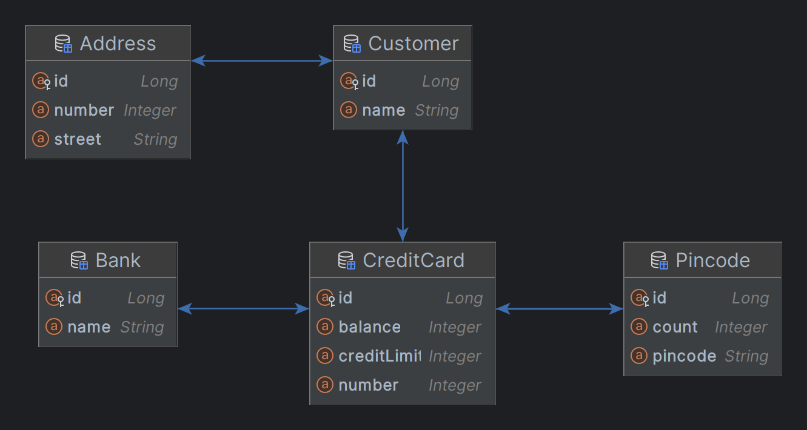

## DAT250: Software Technology Experiment Assignment 4

### Domain test scenario

**Implementation:**
  [CreditCardsMain.java](src/main/java/no/hvl/dat250/jpa/tutorial/creditcards/driver/CreditCardsMain.java)

  
### Domain

**Added members to entities:**
- Address
- Bank
- CreditCard
- Customer
- Pincode

**Domain Diagram**
